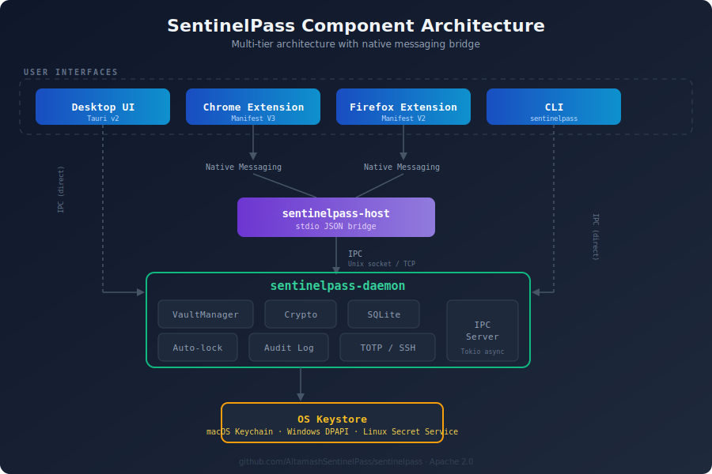
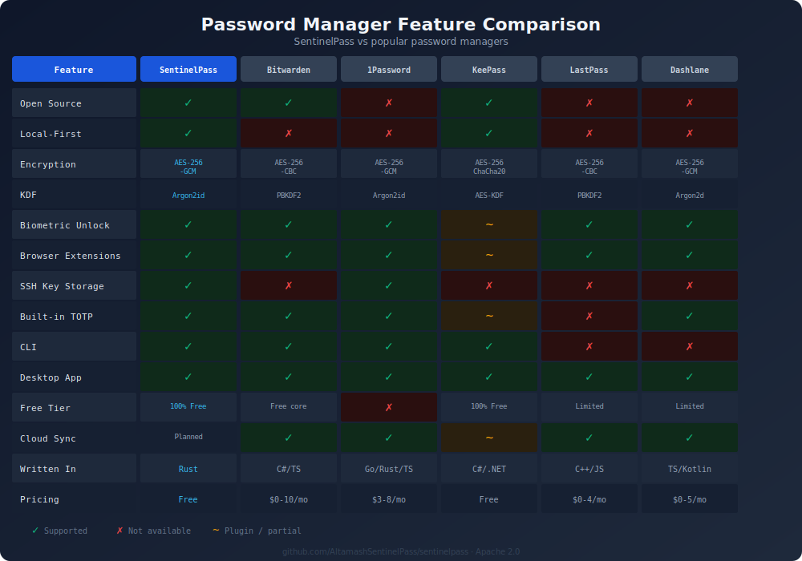

# I Built a Zero-Knowledge Password Manager in Rust -- Here's Why

*A deep dive into SentinelPass: local-first architecture, military-grade encryption, and why your passwords shouldn't live on someone else's server.*

---

## The Problem

In 2022, LastPass disclosed a breach that exposed encrypted vaults for millions of users. The attackers walked away with password vaults, metadata, IP addresses, and more. The encryption held -- for now -- but the metadata didn't, and users with weak master passwords were left hoping their PBKDF2 iterations were high enough.

This wasn't an isolated incident. Password managers have become high-value targets precisely because they consolidate everything. OneLogin, Passwordstate, Norton LifeLock -- the list keeps growing. And every breach follows the same pattern: a cloud-hosted vault that becomes someone else's problem to protect.

Meanwhile, the average person reuses the same 3-5 passwords across dozens of sites. Data breaches expose billions of credential pairs every year, feeding credential-stuffing attacks that compromise accounts in seconds. The paradox is clear: we need password managers, but the most popular ones store our secrets on servers we don't control.

I wanted something different. I wanted a password manager where the vault never leaves my machine. Where even if someone stole the entire database file, they'd face 256 MB of Argon2id memory-hardness before they could try a single master password. Where the code is open source and the encryption is auditable.

So I built SentinelPass.

## Introducing SentinelPass

SentinelPass is a local-first, zero-knowledge password manager written entirely in Rust. It stores your vault on your machine in an encrypted SQLite database. There's no cloud account, no subscription, no telemetry. Your passwords never leave your device unless you explicitly export them.

The project ships as a Rust workspace with five crates: a core library, a CLI, a background daemon, a native messaging host for browser integration, and a Tauri desktop UI. Browser extensions for Chrome and Firefox connect through the native messaging protocol, so autofill works without any cloud relay.

SentinelPass is open source under the Apache 2.0 license. You can audit every line of cryptographic code, build from source, and verify that your secrets are handled exactly as documented.

**Repository**: [github.com/AltamashSentinelPass/sentinelpass](https://github.com/AltamashSentinelPass/sentinelpass)

## Security Architecture

Security isn't a feature you bolt on -- it's the foundation you build on. SentinelPass implements a multi-layer key hierarchy designed to minimize blast radius and maximize attacker cost.


### Key Derivation

When you set your master password, SentinelPass derives a 32-byte master key using **Argon2id** with aggressive parameters:

- **Memory**: 256 MB (m=262,144 blocks)
- **Iterations**: 3 passes (t=3)
- **Parallelism**: 4 lanes (p=4)
- **Salt**: 16 cryptographically random bytes
- **Output**: 32-byte master key

These parameters were chosen to make GPU and ASIC attacks economically infeasible. Each password guess requires 256 MB of memory -- you can't parallelize thousands of guesses on a single GPU the way you can with PBKDF2 or bcrypt.

### Key Hierarchy

The master key is never used directly for encryption. Instead, it derives three purpose-specific keys:

1. **Vault Key** (wrapped) -- encrypts the Data Encryption Key (DEK)
2. **HMAC Key** (derived) -- authenticates vault integrity
3. **Biometric Wrapper** -- enables Touch ID / Windows Hello unlock without re-entering the master password

The DEK performs the actual per-entry encryption. This indirection means rotating your master password doesn't require re-encrypting every entry -- only re-wrapping the DEK.

### Per-Entry Encryption

Every credential entry is individually encrypted with **AES-256-GCM**:

- **Nonce**: 96-bit, randomly generated per entry (never reused)
- **Authentication tag**: 128-bit (tamper detection)
- **Mode**: Galois/Counter Mode (authenticated encryption with associated data)

GCM mode provides both confidentiality and integrity. If a single bit of ciphertext is modified, decryption fails entirely. There's no silent corruption.

### Memory Safety

Sensitive key material is protected in memory:

- **`zeroize()`**: All secrets are zeroed before deallocation -- no lingering key material in freed memory
- **`mlock()`**: Key buffers are locked into physical RAM via the `memsec` crate, preventing the OS from swapping them to disk
- **`SecureBuffer`**: A custom wrapper that enforces zeroization on drop

## Why Rust

I chose Rust for SentinelPass not because it's trendy, but because password manager code has zero margin for memory errors.

**Memory safety without garbage collection.** Rust's ownership system prevents use-after-free, double-free, and buffer overflows at compile time. In a password manager, a dangling pointer to a decrypted password is a vulnerability. Rust makes this class of bugs structurally impossible.

**Deterministic destruction.** When a `SecureBuffer` goes out of scope, Rust guarantees its `Drop` implementation runs, which calls `zeroize()`. In garbage-collected languages, you can't control when (or whether) sensitive data is actually cleared from memory.

**Single-binary deployment.** Each SentinelPass component compiles to a single static binary with no runtime dependencies. No Python interpreter, no JVM, no DLL hell. This simplifies deployment and reduces the attack surface.

**Battle-tested crypto crates.** The Rust cryptography ecosystem (`aes-gcm`, `argon2`, `rand`) is maintained by the RustCrypto team with a strong track record of security audits and constant-time implementations. These aren't hobby implementations -- they're the same primitives used in production systems across the industry.

**Fearless concurrency.** The daemon handles multiple IPC connections concurrently via Tokio. Rust's type system prevents data races at compile time, which matters when you're managing shared vault state across async tasks.

## Architecture & Components

SentinelPass is structured as a Rust workspace with clean separation of concerns.



### Runtime Flow

The typical flow for a browser autofill request:

1. You visit a login page. The **browser extension** detects password fields and shows an autofill button.
2. Clicking "autofill" sends a `get_credential` request via Chrome/Firefox **native messaging** (stdin/stdout JSON with length-prefix framing).
3. **`sentinelpass-host`** receives the message and forwards it over IPC to the daemon.
4. **`sentinelpass-daemon`** validates the domain, looks up the credential, decrypts it, and returns only the requested entry.
5. The response flows back through the host to the extension, which fills the form fields.

The daemon never returns the full vault -- only the single credential matching the validated domain. Domain validation happens daemon-side (not browser-side) to prevent spoofing.

### IPC Security

Inter-process communication uses Unix domain sockets on Linux/macOS and TCP localhost on Windows. Every IPC request must include a 32-byte hex authentication token stored in `~/.config/sentinelpass/ipc.token` with mode `0600`. This prevents other local processes from impersonating the host.

### Auto-Lock

The daemon automatically locks the vault after 5 minutes of inactivity (configurable). When locked, the DEK is zeroized from memory. The next operation requires re-entering the master password or using biometric unlock.

## Feature Walkthrough

### Vault Management

The CLI provides full CRUD operations:

```bash
# Initialize a new vault
sentinelpass init

# Add a credential
sentinelpass add --title "GitHub" --username "user@example.com" --url "github.com"

# Search entries
sentinelpass search github

# Generate a strong password
sentinelpass generate --length 32 --symbols
```

### Browser Extensions

Chrome (MV3) and Firefox (MV2) extensions provide:

- **Auto-detection** of login and registration forms
- **One-click autofill** for saved credentials
- **Save prompts** when submitting new credentials
- **TOTP autofill** for sites with two-factor authentication

The extensions communicate exclusively through native messaging -- no cloud relay, no WebSocket server, no HTTP endpoint.

### TOTP (Time-Based One-Time Passwords)

SentinelPass stores TOTP secrets alongside credentials, eliminating the need for a separate authenticator app:

```bash
# Add a TOTP secret
sentinelpass totp-add --title "GitHub" --secret "JBSWY3DPEHPK3PXP"

# Get current code
sentinelpass totp-code --title "GitHub"
# → 482931 (expires in 18s)
```

### SSH Key Storage

Store and retrieve SSH keys from the encrypted vault:

```bash
# Store an SSH key
sentinelpass ssh-key-add --name "deploy-key" --key-file ~/.ssh/id_ed25519

# List stored keys
sentinelpass ssh-key-list

# Retrieve a key
sentinelpass ssh-key-get --name "deploy-key"
```

### Biometric Unlock

On macOS (Touch ID) and Windows (Windows Hello), you can unlock the vault with biometrics instead of typing the master password:

```bash
sentinelpass biometric-enable
```

The biometric wrapper key is stored in the OS keystore (Keychain / DPAPI) and used to unwrap the vault key without exposing the master password.

### Import & Export

Migrate from other password managers or create encrypted backups:

```bash
# Export vault (encrypted JSON)
sentinelpass export --output vault-backup.json

# Import from CSV (Chrome, Firefox, Bitwarden format)
sentinelpass import --format csv --input passwords.csv
```

## How SentinelPass Compares

Here's an honest comparison with popular password managers.



For platforms that don't render SVG, here's the same data as a table:

| Feature | SentinelPass | Bitwarden | 1Password | KeePass | LastPass | Dashlane |
|---------|:---:|:---:|:---:|:---:|:---:|:---:|
| Open Source | Yes | Yes | No | Yes | No | No |
| Local-First | Yes | No | No | Yes | No | No |
| Encryption | AES-256-GCM | AES-256-CBC | AES-256-GCM | AES-256/ChaCha20 | AES-256-CBC | AES-256-GCM |
| KDF | Argon2id | PBKDF2 | Argon2id | AES-KDF | PBKDF2 | Argon2d |
| Biometric | Yes | Yes | Yes | Plugin | Yes | Yes |
| Browser Ext. | Yes | Yes | Yes | Plugin | Yes | Yes |
| SSH Keys | Yes | No | Yes | No | No | No |
| TOTP | Yes | Yes | Yes | Plugin | No | Yes |
| CLI | Yes | Yes | Yes | Yes | No | No |
| Desktop App | Yes | Yes | Yes | Yes | Yes | Yes |
| Free Tier | 100% Free | Free core | No | 100% Free | Limited | Limited |
| Cloud Sync | Planned | Yes | Yes | Plugin | Yes | Yes |
| Written In | Rust | C#/TS | Go/Rust/TS | C#/.NET | C++/JS | TS/Kotlin |
| Pricing | Free | $0-10/mo | $3-8/mo | Free | $0-4/mo | $0-5/mo |

**Where SentinelPass wins**: Local-first architecture, Argon2id with 256 MB memory cost, SSH key storage, fully free and open source, written in a memory-safe language from the ground up.

**Where others win**: Cloud sync (Bitwarden, 1Password), mobile apps (all major players), team/enterprise features, established security audits.

SentinelPass is honest about its current scope. It's a v0.1.x release focused on getting the security foundation right. Cloud sync and mobile apps are on the roadmap, but they'll be opt-in, not default.

## Getting Started

### Installation

Download the latest release for your platform from the [GitHub Releases page](https://github.com/AltamashSentinelPass/sentinelpass/releases/tag/v0.1.2):

- **macOS**: `sentinelpass-0.1.2-macos.tar.gz` (Universal binary)
- **Linux**: `sentinelpass-0.1.2-linux.tar.gz` or `.deb` / `.rpm` packages
- **Windows**: `sentinelpass-0.1.2-windows.zip` or `.msi` installer

> **Note**: GitHub release downloads use HTTP 302 redirects. Use `curl -L` (with `-L` to follow redirects) or `wget` to download from the command line. Plain `curl` without `-L` will result in a 0-byte file.

```bash
# Download (macOS example)
curl -L -o sentinelpass.tar.gz \
  https://github.com/AltamashSentinelPass/sentinelpass/releases/download/v0.1.2/sentinelpass-0.1.2-macos.tar.gz

# Extract
tar xzf sentinelpass.tar.gz

# Initialize vault
./sentinelpass init

# Add your first credential
./sentinelpass add --title "My First Entry" --username "user@example.com"
```

### Browser Extension

1. Download the Chrome or Firefox extension zip from the release page
2. **Chrome**: Navigate to `chrome://extensions/`, enable Developer Mode, click "Load unpacked", select the extracted folder
3. **Firefox**: Navigate to `about:debugging#/runtime/this-firefox`, click "Load Temporary Add-on", select the `manifest.json`
4. Start the daemon: `./sentinelpass-daemon`
5. Register the native host: `./sentinelpass-host --register`

### Desktop UI

The Tauri-based desktop app provides a graphical interface:

```bash
# Run from release binary
./sentinelpass-ui

# Or build from source
npm install && npm run web:build
cargo run --package sentinelpass-ui
```

## What's Next

SentinelPass v0.1.2 lays the security foundation. Here's what's on the roadmap:

- **Mobile apps** (iOS/Android) -- likely using the same Rust core with platform-native UI
- **Opt-in encrypted cloud sync** -- end-to-end encrypted, self-hostable relay server
- **KeePass import/export** -- for users migrating from KeePass databases
- **Passkey / WebAuthn support** -- storing and managing FIDO2 credentials
- **Security audit** -- third-party audit of the cryptographic implementation
- **Browser extension polish** -- improved form detection, inline TOTP, settings UI

The architecture is designed to support all of these without compromising the local-first principle. Cloud sync, when it arrives, will be opt-in and end-to-end encrypted -- the server will never see plaintext.

## Try It

SentinelPass v0.1.2 is live now. If you're the kind of person who reads this far into a technical blog post, you're exactly who this project is for.

- **Star the repo**: [github.com/AltamashSentinelPass/sentinelpass](https://github.com/AltamashSentinelPass/sentinelpass)
- **Download v0.1.2**: [Latest Release](https://github.com/AltamashSentinelPass/sentinelpass/releases/tag/v0.1.2)
- **Report issues**: [GitHub Issues](https://github.com/AltamashSentinelPass/sentinelpass/issues)
- **Contribute**: PRs welcome -- check the `CLAUDE.md` for architecture docs and coding guidelines

Your passwords are yours. Keep them that way.

---

*SentinelPass is licensed under Apache 2.0. This article reflects the state of the project as of v0.1.2 (February 2026).*
